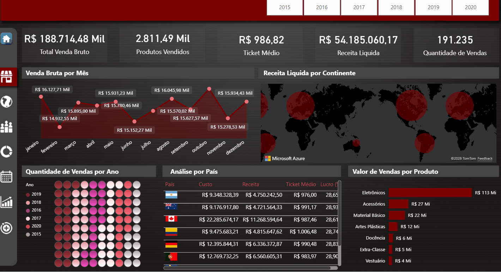
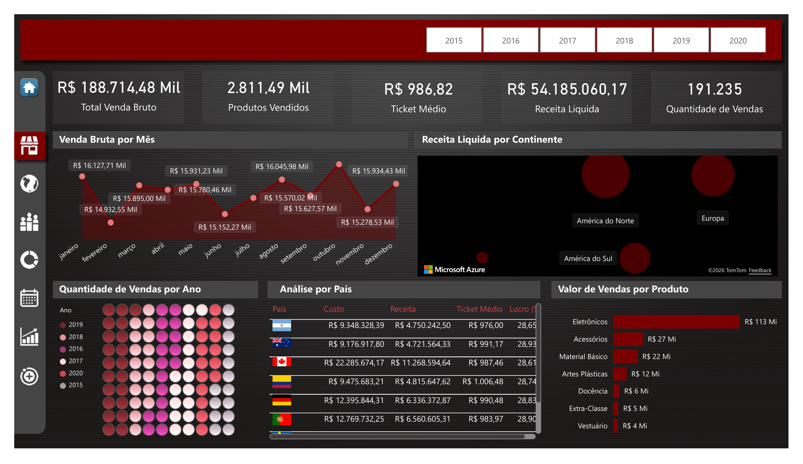
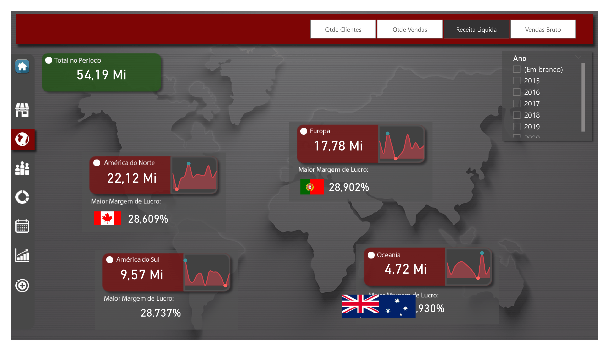
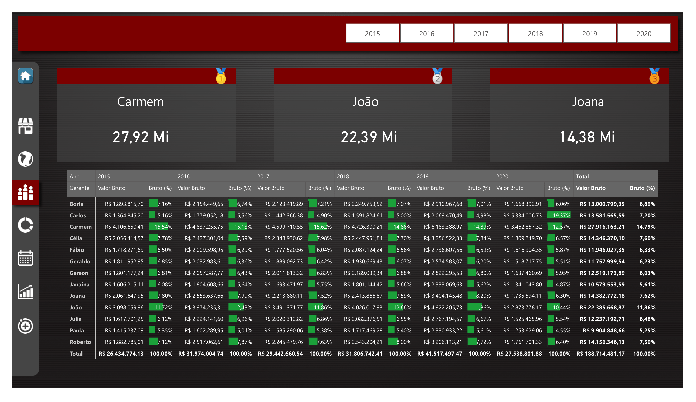
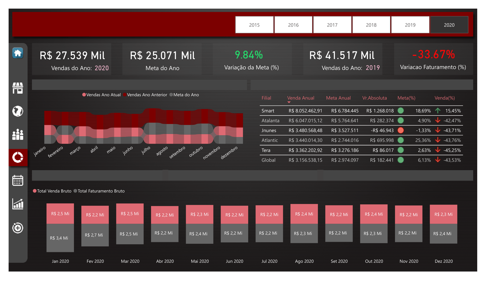
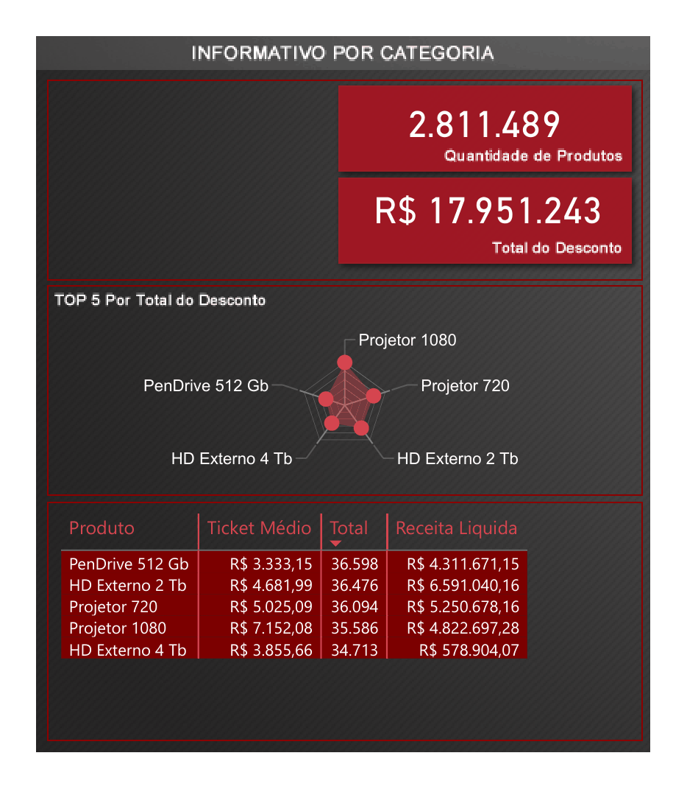
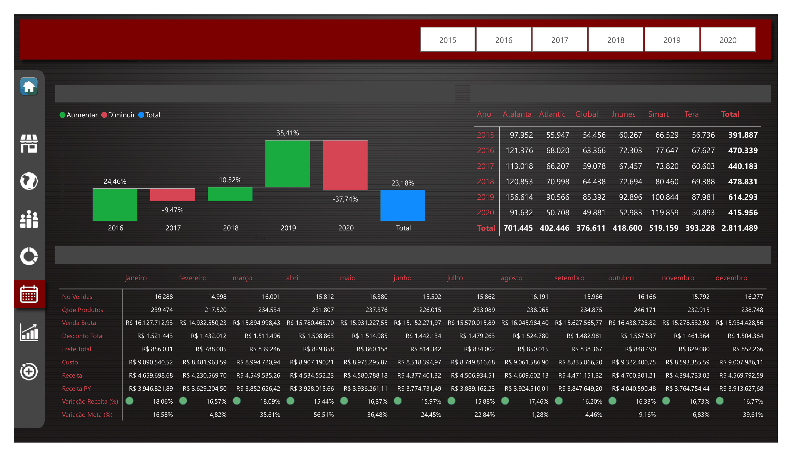
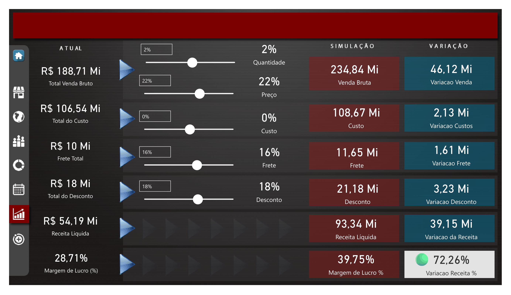
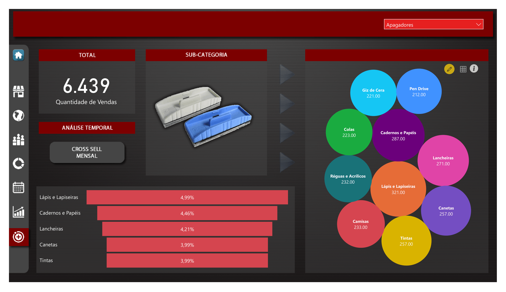

# Dashboard de Vendas – Projeto Power BI DAX

## Sobre o Projeto
Este dashboard foi desenvolvido como parte do curso **Master Power BI – DAX** do Felipe Mafra.  
O objetivo foi criar um projeto completo de Power BI, aplicando medidas DAX, inteligência temporal e visualizações interativas para análise de vendas de uma empresa fictícia exportadora de materiais escolares, a **Majestic**.

O projeto simula cenários reais de análise de vendas e permite gerar insights estratégicos para suporte à tomada de decisão.

---

## Funcionalidades
- +90 medidas DAX aplicadas para cálculos e KPIs  
- Análise de performance de gerentes e ranking de vendas  
- Inteligência temporal para comparações entre períodos  
- Clusterização de produtos para análise de padrões de vendas  
- Dashboards interativos com filtros dinâmicos por país, continente, produto e gerente  
- Visualizações que destacam margens de lucro, volume de vendas e tendências  

---

## Insights Gerados
Mesmo focando no aprendizado de DAX, o dashboard possibilita identificar:

- **Desempenho por gerente:** Facilita identificar líderes de vendas e áreas de melhoria.  
- **Margem de lucro por continente e país:** Permite focar em regiões mais lucrativas.  
- **Produtos com maior impacto:** A clusterização evidencia produtos que contribuem mais para receita e margem.  
- **Tendências de vendas:** Inteligência temporal permite comparar períodos, como mês a mês ou ano a ano, mostrando crescimento ou queda de performance.  
- **Apoio à tomada de decisão:** KPIs e rankings fornecem uma visão rápida para decisões estratégicas.

---

## Habilidades e Tecnologias
- **Power BI Desktop**  
- **DAX** (medidas, contexto, inteligência temporal, ranking, simulação de cenários)  
- **Power Query (M)**  
- **Modelagem de Dados e Star Schema**  
- **Visualização de Dados e Storytelling**  

---

## Como Executar
1. Instale o Power BI Desktop.  
2. Clone o repositório:
```bash
git clone https://github.com/rafaelarochf/analise-vendas-powerbi
```

**Créditos:**  
Projeto desenvolvido no curso *Master Power BI – DAX* (Felipe Mafra). Todo o aprendizado e prática aplicados no projeto são fruto da metodologia e instruções do curso.

## Demonstração do Dashboard



## Prints do Dashboard








